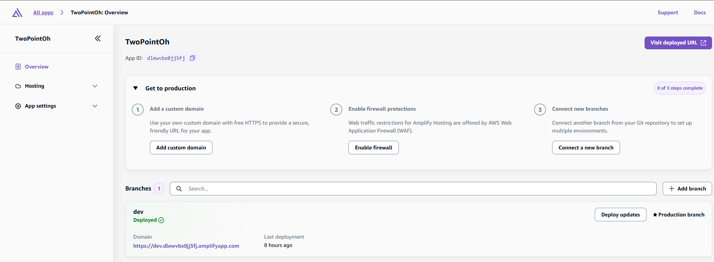
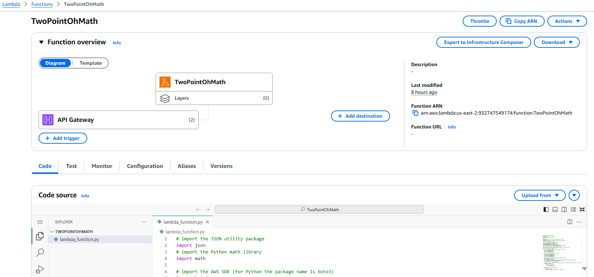
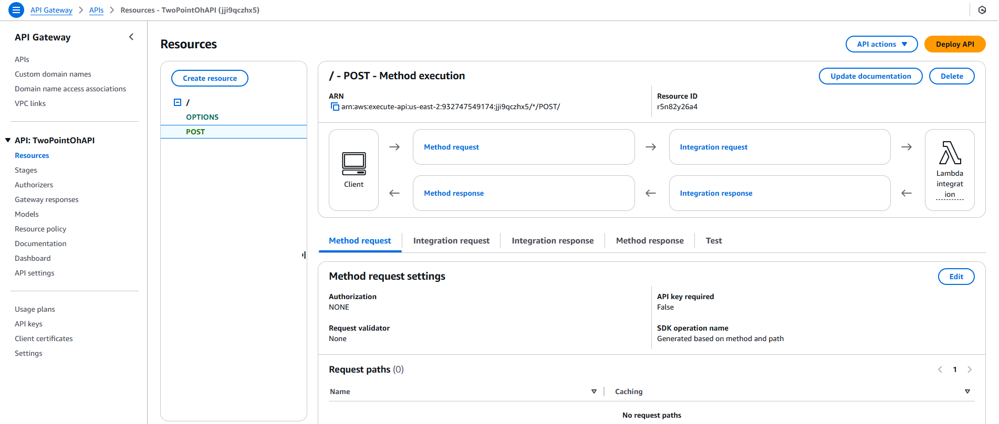
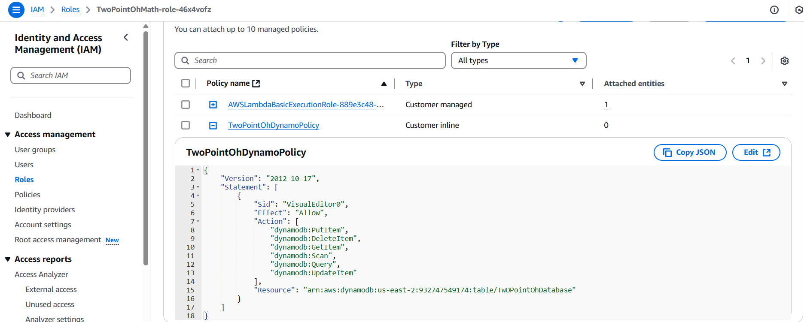
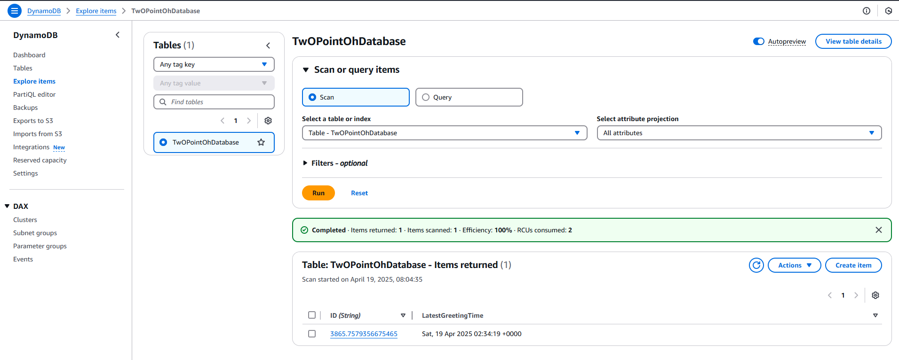

# AWS-Serverless-Project

#### AWS Amplify, AWS Lambda (using Python), Amazon API Gateway, Amazon DynamoDB, AWS Identity & Access Management (IAM)

### Use following steps.

- Step 1 : Clone this GitHub repository.

- Step 2 : Deploy Amplify App.

- Step 3 : Create Lambda Function.

- Step 4 : Create Rest API in APIGateway and Enable CORS in API Gateway.

- Step 5 - Assign IAM policy for Lambda Role.

- Step 6 - Create DynamoDB Table.

- Sample values for Test Application.

Starbucks headquarters in Seattle, WA
47.5975024
-122.3492781

Times Square in New York City, NY
40.7579787
-73.9900326
