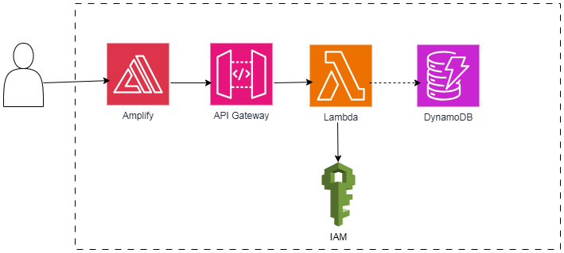

# AWS-Serverless-Project

#### AWS Amplify, AWS Lambda (using Python), Amazon API Gateway, Amazon DynamoDB, AWS Identity & Access Management (IAM)

### Use following steps.

- Step 1 : Clone this GitHub repository.

- Step 2 : Create Container registry.

- Enable CORS in API Gateway

-

Starbucks headquarters in Seattle, WA
47.5975024
-122.3492781

Times Square in New York City, NY
40.7579787
-73.9900326
